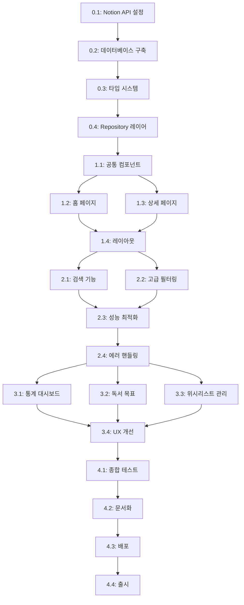

# 🗺️ 프로젝트 로드맵

> PRD 기반 자동 생성 | 생성일: 2026-02-11

## 📋 프로젝트 개요

**독서 기록 및 위시리스트 (Reading Log & Wishlist)**는 Notion을 CMS로 활용하여 개인의 독서 활동을 체계적으로 관리하고 공유할 수 있는 웹 애플리케이션입니다. Next.js 15와 TypeScript를 기반으로 하며, Notion API를 통해 실시간으로 독서 기록을 동기화합니다.

## 🎯 핵심 목표

- [ ] Notion API를 활용한 독서 기록 CMS 구축
- [ ] 독서 상태별(읽고 싶음/읽는 중/완독) 필터링 및 관리
- [ ] 반응형 UI로 모든 기기에서 최적의 사용자 경험 제공
- [ ] 2초 이내 페이지 로드 성능 달성
- [ ] TypeScript 타입 안정성 100% 확보

## 🏗️ 기술 스택

| 카테고리 | 기술 | 비고 |
|---------|------|------|
| 프레임워크 | Next.js 16 | App Router, Server Components |
| 언어 | TypeScript | Strict 모드 |
| UI 라이브러리 | shadcn/ui | Radix UI 기반 |
| 스타일링 | Tailwind CSS v4 | 다크모드 지원 |
| CMS | Notion API | @notionhq/client v2.2.15 |
| 상태 관리 | React 19 | Server State 우선 |
| 날짜 처리 | date-fns v4 | 한국어 로케일 지원 |
| 검증 | Zod v4 | 타입 안전 스키마 |
| 아이콘 | Lucide React | Tree-shakeable |
| 테마 | next-themes | 다크/라이트 모드 |

## 📅 개발 페이즈

### Phase 0: 프로젝트 기반 구축 ⏱️ ~3일
> 목표: Notion 연동 환경 구축 및 타입 시스템 설계

#### 마일스톤 0.1: Notion API 연동 환경 설정 `예상: S`
- [ ] `@notionhq/client` 패키지 설치 및 버전 확인
- [ ] `.env.local` 파일 생성 및 환경 변수 설정
  - `NOTION_API_KEY`: Notion Integration 시크릿 키
  - `NOTION_DATABASE_ID`: 독서 기록 데이터베이스 ID
- [ ] Notion Integration 생성
  - Notion 워크스페이스에서 Integration 생성
  - 데이터베이스에 Integration 연결 권한 부여
- [ ] `src/lib/notion.ts` Notion 클라이언트 설정 파일 생성
  - Client 인스턴스 초기화
  - 환경 변수 검증 로직 추가
- **산출물**: Notion API 연결 테스트 성공
- **완료 기준**: Notion 데이터베이스 쿼리 1회 이상 성공

#### 마일스톤 0.2: Notion 데이터베이스 구축 `예상: S`
- [ ] Notion 워크스페이스에 "독서 기록" 데이터베이스 생성
- [ ] 필수 속성 7개 추가
  - 제목 (Title) - 필수
  - 저자 (Rich Text) - 필수
  - 독서 상태 (Select: 읽고 싶음/읽는 중/완독) - 필수
  - 평점 (Number: 0-5) - 선택
  - 읽은 날짜 (Date) - 선택
  - 한줄평 (Rich Text: 최대 200자) - 선택
  - 태그 (Multi-select: 소설, 에세이, 자기계발 등) - 선택
- [ ] 테스트 데이터 5개 이상 입력
  - 다양한 독서 상태 포함
  - 평점 및 태그 다양성 확보
- [ ] Integration 연결 확인
- **산출물**: 테스트 데이터가 포함된 Notion 데이터베이스
- **완료 기준**: API를 통해 테스트 데이터 조회 성공

#### 마일스톤 0.3: 타입 시스템 및 데이터 변환 레이어 구축 `예상: M`
- [ ] `src/types/book.ts` 타입 정의 파일 생성
  - Book 인터페이스 정의
  - ReadingStatus 타입 (enum 또는 union)
  - Tag, Rating 타입 정의
- [ ] `src/types/notion.ts` Notion 전용 타입 정의
  - NotionPage, NotionProperty 타입
  - Notion API 응답 타입 래핑
- [ ] `src/lib/notion/transformers.ts` 데이터 변환 함수 생성
  - `transformNotionPageToBook()`: Notion 페이지 → Book 타입 변환
  - `extractRichText()`: Rich Text 속성 파싱
  - `extractSelect()`: Select 속성 파싱
  - `extractMultiSelect()`: Multi-select 속성 파싱
  - `extractNumber()`: Number 속성 파싱
  - `extractDate()`: Date 속성 파싱
- [ ] Zod 스키마 정의 (`src/lib/validators/book.ts`)
  - bookSchema: 런타임 타입 검증
  - readingStatusSchema: 독서 상태 검증
- [ ] 에러 핸들링 유틸리티 추가
  - NotionAPIError 커스텀 에러 클래스
  - 타입 변환 실패 시 fallback 로직
- **산출물**: 타입 안전 데이터 변환 레이어
- **완료 기준**: TypeScript 타입 에러 0개, Zod 검증 통과

#### 마일스톤 0.4: Repository 레이어 구현 `예상: M`
- [ ] `src/repositories/book.repository.ts` 생성
- [ ] `getAllBooks()`: 모든 책 조회 함수
  - Notion 데이터베이스 쿼리
  - 데이터 변환 및 정렬 (최근 수정 순)
  - 페이지네이션 지원 (기본 100개)
- [ ] `getBookById(pageId: string)`: ID로 책 조회 함수
  - 개별 페이지 조회
  - 404 에러 핸들링
- [ ] `getBooksByStatus(status: ReadingStatus)`: 독서 상태별 필터링 함수
  - Notion 필터 쿼리 활용
  - 상태별 정렬 로직
- [ ] `getBooksByTags(tags: string[])`: 태그별 필터링 함수
- [ ] 에러 핸들링 및 재시도 로직
  - Rate limit 대응
  - Network error 재시도 (최대 3회)
- [ ] Repository 유닛 테스트 (선택)
- **산출물**: 데이터 접근 레이어 (Repository Pattern)
- **완료 기준**: 모든 Repository 함수가 정상 작동하며 에러 핸들링 완료
- **리스크**: Notion API Rate Limit 초과 가능성 → 캐싱 전략 필요 시 Next.js 캐시 활용

---

### Phase 1: 핵심 기능 (MVP) ⏱️ ~5일
> 목표: 독서 기록 목록 조회 및 상세 페이지 구현으로 MVP 완성
> 의존성: Phase 0 완료

#### 마일스톤 1.1: 공통 컴포넌트 구축 `예상: M`
- [ ] `src/components/books/status-badge.tsx` 생성
  - 독서 상태별 배지 컴포넌트
  - 색상: 읽고 싶음(회색), 읽는 중(파란색), 완독(초록색)
  - shadcn/ui Badge 컴포넌트 활용
- [ ] `src/components/books/rating-stars.tsx` 생성
  - 평점 별 표시 컴포넌트 (0-5점, 0.5 단위)
  - 채워진 별 / 빈 별 / 반 별 표시
  - Lucide React의 Star 아이콘 사용
- [ ] `src/components/books/tag-list.tsx` 생성
  - 태그 목록 표시 컴포넌트
  - shadcn/ui Badge 컴포넌트 활용
- [ ] `src/components/common/back-button.tsx` 생성
  - 뒤로가기 버튼 컴포넌트
  - Next.js router.back() 활용
- [ ] 로딩 상태 컴포넌트
  - `src/components/common/skeleton-card.tsx`: 카드 스켈레톤
  - Skeleton UI 패턴 적용
- **산출물**: 재사용 가능한 UI 컴포넌트 라이브러리
- **완료 기준**: Storybook 또는 독립 페이지에서 모든 컴포넌트 시각적 확인 완료

#### 마일스톤 1.2: 홈 페이지 (목록) 구현 `예상: L`
- [ ] `src/app/page.tsx` 홈 페이지 구현
  - Server Component로 데이터 fetch
  - `getAllBooks()` 호출
  - 에러 바운더리 추가
- [ ] `src/components/books/book-card.tsx` 생성
  - 책 제목, 저자, 독서 상태, 평점, 태그, 읽은 날짜 표시
  - 카드 클릭 시 상세 페이지로 이동
  - 호버 효과 추가 (그림자, 스케일)
- [ ] `src/components/books/book-list.tsx` 생성
  - 반응형 그리드 레이아웃
    - 모바일: 1열
    - 태블릿: 2열
    - 데스크톱: 3열
  - 빈 상태(Empty State) 처리
- [ ] `src/components/books/book-filter-tabs.tsx` 생성
  - 필터 탭: 전체 / 읽고 싶음 / 읽는 중 / 완독
  - Client Component (useState 사용)
  - URL 쿼리 파라미터와 동기화 (선택)
- [ ] 정렬 기능 구현 (선택)
  - 최근 순 (기본)
  - 평점 순
  - 제목 순 (가나다순)
- [ ] 로딩 상태 처리
  - `loading.tsx` 파일 생성
  - Skeleton UI 표시
- [ ] 에러 상태 처리
  - `error.tsx` 파일 생성
  - 에러 메시지 및 재시도 버튼
- **산출물**: 독서 기록 목록 페이지 (반응형)
- **완료 기준**: 모든 데이터가 정상적으로 표시되며, 필터링 및 반응형 레이아웃 작동

#### 마일스톤 1.3: 상세 페이지 구현 `예상: M`
- [ ] `src/app/books/[id]/page.tsx` 생성
  - Dynamic Route 설정
  - `getBookById(id)` 호출
  - Server Component로 구현
- [ ] `src/components/books/book-detail.tsx` 생성
  - 책 제목, 저자 (큰 헤딩)
  - 독서 상태 배지
  - 평점 표시 (큰 별 아이콘)
  - 읽은 날짜 (date-fns 포맷)
  - 태그 목록
  - 한줄평 (여러 줄 지원)
  - 메타 정보 (생성 날짜, 수정 날짜)
- [ ] 뒤로가기 버튼 추가
- [ ] 레이아웃 스타일링
  - 중앙 정렬 컨텐츠 카드
  - 최대 너비 800px
  - 여백과 그림자로 깔끔한 UI
- [ ] 로딩 상태 처리
  - `loading.tsx` 파일 생성
- [ ] 에러 상태 처리
  - `error.tsx` 파일 생성
  - 404 Not Found 처리
- [ ] generateStaticParams 구현 (선택)
  - 정적 생성 최적화
- [ ] generateMetadata 구현
  - 동적 메타 태그 (책 제목, 저자)
  - OG 이미지 (선택)
- **산출물**: 독서 기록 상세 페이지
- **완료 기준**: 개별 책 정보가 모두 표시되며, 뒤로가기 및 SEO 최적화 완료

#### 마일스톤 1.4: 레이아웃 및 헤더 구현 `예상: S`
- [ ] `src/app/layout.tsx` 루트 레이아웃 최적화
  - 메타 태그 추가 (title, description)
  - 폰트 최적화 (next/font)
  - ThemeProvider 설정 확인
- [ ] `src/components/layout/header.tsx` 생성
  - 사이트 제목 "나의 독서 기록"
  - 다크모드 토글 버튼
  - 모바일 반응형 헤더
- [ ] `src/components/layout/footer.tsx` 생성 (선택)
  - 저작권 정보
  - GitHub 링크 (선택)
- [ ] 다크모드 테스트
  - 모든 컴포넌트에서 다크모드 정상 작동 확인
- **산출물**: 일관된 레이아웃 시스템
- **완료 기준**: 헤더 및 다크모드가 모든 페이지에서 정상 작동

---

### Phase 2: 필수 기능 확장 ⏱️ ~3일
> 목표: 검색, 고급 필터링, 성능 최적화로 실사용 가능한 수준 달성
> 의존성: Phase 1 완료

#### 마일스톤 2.1: 검색 기능 구현 `예상: M`
- [ ] `src/components/books/search-bar.tsx` 생성
  - 검색 입력 필드 (제목, 저자 기반)
  - Debounce 적용 (300ms)
  - 검색어 하이라이팅
- [ ] 검색 로직 구현
  - 클라이언트 측 필터링 (작은 데이터셋)
  - 또는 Notion API 필터 쿼리 활용
- [ ] 검색 결과 없음 처리
  - Empty State UI
- [ ] URL 쿼리 파라미터와 동기화
  - `?search=검색어` 형식
  - 뒤로가기/앞으로가기 지원
- **산출물**: 검색 기능이 포함된 홈 페이지
- **완료 기준**: 제목 및 저자 검색이 정상 작동하며 UX가 자연스러움

#### 마일스톤 2.2: 태그별 필터링 및 정렬 기능 `예상: M`
- [ ] `src/components/books/tag-filter.tsx` 생성
  - 모든 태그 목록 표시
  - 다중 태그 선택 지원
  - 선택된 태그 배지 표시
- [ ] 정렬 옵션 UI 구현
  - Dropdown 또는 Radio 버튼
  - 정렬 옵션: 최근 순, 평점 순, 제목 순, 읽은 날짜 순
- [ ] 필터 및 정렬 상태 관리
  - URL 쿼리 파라미터 활용
  - 필터 초기화 버튼
- [ ] 필터 결과 카운트 표시
  - "전체 50권 중 12권 표시" 등
- **산출물**: 고급 필터링 및 정렬 기능
- **완료 기준**: 태그 필터 및 정렬이 모두 정상 작동하며 URL 상태 동기화 완료

#### 마일스톤 2.3: 성능 최적화 및 캐싱 `예상: M`
- [ ] Next.js 캐시 전략 적용
  - `revalidate` 옵션 설정 (예: 60초)
  - ISR (Incremental Static Regeneration) 활용
- [ ] 이미지 최적화 (향후 책 표지 이미지 추가 대비)
  - next/image 컴포넌트 사용 준비
- [ ] 페이지 로드 성능 측정
  - Lighthouse 점수 90점 이상 목표
  - Core Web Vitals 최적화
- [ ] Notion API 호출 최적화
  - 불필요한 쿼리 제거
  - 병렬 처리 가능한 쿼리 최적화
- [ ] Bundle 크기 최적화
  - Tree shaking 확인
  - 사용하지 않는 라이브러리 제거
- **산출물**: 최적화된 성능 지표
- **완료 기준**: 페이지 로드 시간 2초 이내, Lighthouse 점수 90점 이상

#### 마일스톤 2.4: 에러 핸들링 및 로깅 강화 `예상: S`
- [ ] 전역 에러 바운더리 개선
  - 사용자 친화적 에러 메시지
  - 에러 리포팅 (Sentry 연동 선택)
- [ ] Notion API 에러 처리 강화
  - Rate limit 에러 → 사용자에게 안내
  - Network 에러 → 재시도 UI 제공
  - 데이터베이스 없음 → 설정 안내 페이지
- [ ] 로딩 상태 개선
  - Progressive Loading
  - Optimistic UI (선택)
- [ ] 접근성 (a11y) 개선
  - ARIA 레이블 추가
  - 키보드 네비게이션 테스트
  - 스크린 리더 테스트
- **산출물**: 안정적인 에러 핸들링 시스템
- **완료 기준**: 모든 에러 케이스에 대한 사용자 피드백 제공 완료

---

### Phase 3: 고도화 ⏱️ ~4일
> 목표: 독서 통계, 데이터 시각화, 고급 UX 개선
> 의존성: Phase 2 완료

#### 마일스톤 3.1: 독서 통계 대시보드 구현 `예상: L`
- [ ] `src/app/stats/page.tsx` 통계 페이지 생성
- [ ] 통계 데이터 계산 로직 구현
  - 총 독서량 (전체, 월별, 연도별)
  - 평균 평점
  - 장르별 분포
  - 독서 상태별 분포
  - 월별 독서량 추이
- [ ] `src/components/stats/reading-stats-summary.tsx` 생성
  - 주요 지표 카드 (총 독서량, 평균 평점 등)
- [ ] `src/components/stats/genre-distribution-chart.tsx` 생성
  - 장르별 파이 차트 또는 바 차트
  - Recharts 또는 Chart.js 라이브러리 사용
- [ ] `src/components/stats/monthly-reading-chart.tsx` 생성
  - 월별 독서량 라인 차트
  - 최근 12개월 데이터
- [ ] 통계 데이터 캐싱
  - 통계 계산 비용 최적화
- [ ] 반응형 차트 레이아웃
  - 모바일에서도 가독성 유지
- **산출물**: 독서 통계 대시보드
- **완료 기준**: 모든 통계 지표가 정확히 계산되며 차트가 정상 표시됨
- **리스크**: 차트 라이브러리 선택 및 성능 이슈 → 가벼운 라이브러리 선택 필요

#### 마일스톤 3.2: 독서 목표 설정 및 진행률 표시 `예상: M`
- [ ] 독서 목표 설정 UI 구현
  - 연간 목표 권수 설정
  - 월간 목표 권수 설정 (선택)
  - LocalStorage 또는 Notion 속성에 저장
- [ ] `src/components/stats/reading-goal-progress.tsx` 생성
  - 진행률 바 (Progress 컴포넌트)
  - 달성률 퍼센트 표시
  - 남은 책 권수 표시
- [ ] 목표 달성 시 축하 애니메이션 (선택)
  - Confetti 효과
- [ ] 홈 페이지에 목표 위젯 추가
  - 사이드바 또는 상단에 고정
- **산출물**: 독서 목표 기능
- **완료 기준**: 목표 설정 및 진행률 표시가 정상 작동

#### 마일스톤 3.3: 위시리스트 우선순위 관리 `예상: M`
- [ ] 우선순위 속성 추가 (Notion 데이터베이스)
  - Priority (Select: 높음/중간/낮음)
- [ ] `src/app/wishlist/page.tsx` 위시리스트 전용 페이지 생성
  - "읽고 싶음" 상태만 필터링
  - 우선순위별 정렬
- [ ] 드래그 앤 드롭으로 우선순위 변경 (선택)
  - dnd-kit 또는 react-beautiful-dnd 사용
- [ ] 위시리스트 전용 뷰 옵션
  - 리스트 뷰 / 그리드 뷰 토글
- **산출물**: 위시리스트 관리 기능
- **완료 기준**: 우선순위별 정렬 및 위시리스트 전용 페이지 완성

#### 마일스톤 3.4: UX 개선 및 마이크로 인터랙션 `예상: S`
- [ ] 애니메이션 추가
  - 페이지 전환 애니메이션
  - 카드 호버 효과 강화
  - 로딩 애니메이션 개선
- [ ] 키보드 단축키 지원
  - 검색 포커스 (Ctrl+K 또는 Cmd+K)
  - 필터 전환 (숫자 키)
- [ ] 즐겨찾기 기능 (선택)
  - LocalStorage에 즐겨찾는 책 저장
  - 즐겨찾기 페이지 또는 필터
- [ ] 공유 기능 UI 준비 (Phase 4 대비)
  - 공유 버튼 추가
  - URL 복사 기능
- [ ] 사용자 온보딩 (선택)
  - 첫 방문 시 튜토리얼 모달
  - 빈 상태에서 시작 가이드
- **산출물**: 향상된 사용자 경험
- **완료 기준**: 애니메이션 및 키보드 단축키가 정상 작동하며 UX가 자연스러움

---

### Phase 4: 안정화 및 출시 ⏱️ ~2일
> 목표: 테스트, 문서화, 배포 준비 완료
> 의존성: Phase 3 완료

#### 마일스톤 4.1: 종합 테스트 `예상: M`
- [ ] 기능 테스트
  - 모든 페이지 정상 작동 확인
  - 필터, 검색, 정렬 기능 테스트
  - 다양한 데이터 시나리오 테스트
- [ ] 브라우저 호환성 테스트
  - Chrome, Safari, Firefox, Edge
  - 모바일 브라우저 (iOS Safari, Android Chrome)
- [ ] 반응형 테스트
  - 모바일 (320px~)
  - 태블릿 (768px~)
  - 데스크톱 (1024px~)
- [ ] 성능 테스트
  - Lighthouse 점수 재측정
  - Core Web Vitals 확인
  - 느린 네트워크 환경 테스트
- [ ] 접근성 테스트
  - WAVE 또는 axe DevTools 사용
  - 키보드 네비게이션 전체 테스트
  - 스크린 리더 테스트 (NVDA, VoiceOver)
- [ ] 에러 시나리오 테스트
  - Notion API 연결 실패
  - 잘못된 데이터베이스 ID
  - Rate limit 초과
- **산출물**: 테스트 체크리스트 및 버그 리포트
- **완료 기준**: 모든 테스트 케이스 통과, 크리티컬 버그 0개

#### 마일스톤 4.2: 문서화 및 README 작성 `예상: S`
- [ ] README.md 업데이트
  - 프로젝트 소개
  - 주요 기능 설명
  - 스크린샷 추가
  - 기술 스택 명시
- [ ] 설치 및 실행 가이드 작성
  - Notion API 키 발급 방법
  - 데이터베이스 설정 방법
  - 로컬 환경 실행 방법
- [ ] 환경 변수 설명서 작성
  - `.env.example` 파일 생성
  - 각 환경 변수 용도 설명
- [ ] 배포 가이드 작성
  - Vercel 배포 방법
  - 환경 변수 설정 방법
- [ ] 기여 가이드 작성 (선택)
  - 코드 스타일 가이드
  - PR 템플릿
- [ ] 라이선스 선택 및 추가
  - MIT License 권장
- **산출물**: 완전한 프로젝트 문서
- **완료 기준**: README를 보고 제3자가 프로젝트를 설정 및 실행 가능

#### 마일스톤 4.3: 배포 및 모니터링 설정 `예상: S`
- [ ] Vercel 프로젝트 생성
  - GitHub 연동
  - 자동 배포 설정
- [ ] 환경 변수 설정
  - Vercel 대시보드에서 환경 변수 입력
- [ ] 도메인 연결 (선택)
  - 커스텀 도메인 설정
- [ ] 프로덕션 빌드 테스트
  - `npm run build` 에러 확인
  - 빌드 결과물 검증
- [ ] 모니터링 설정 (선택)
  - Vercel Analytics 활성화
  - Sentry 연동 (에러 추적)
- [ ] OG 이미지 생성 (선택)
  - 소셜 미디어 공유용 이미지
- [ ] robots.txt 및 sitemap.xml 생성
  - SEO 최적화
- **산출물**: 운영 환경 배포 완료
- **완료 기준**: 프로덕션 URL에서 모든 기능 정상 작동

#### 마일스톤 4.4: 출시 준비 및 피드백 수집 `예상: S`
- [ ] 베타 테스터 모집 (선택)
  - 지인 또는 커뮤니티에 공유
- [ ] 피드백 수집 채널 설정
  - GitHub Issues
  - 또는 구글 폼
- [ ] 버전 1.0 릴리스 노트 작성
  - 주요 기능 요약
  - 알려진 이슈 명시
- [ ] 소셜 미디어 공유 준비
  - 프로젝트 소개 포스트 작성
  - 스크린샷 및 데모 영상 준비 (선택)
- [ ] 출시 체크리스트 최종 확인
  - 모든 환경 변수 설정 완료
  - 프로덕션 빌드 성공
  - 성능 지표 목표 달성
- **산출물**: 출시 가능한 제품
- **완료 기준**: 프로젝트가 공개 준비 완료 및 릴리스 노트 작성 완료

---

## 🔗 의존성 다이어그램

---

## ⚠️ 리스크 매트릭스

| 리스크 | 영향도 | 발생 가능성 | 완화 방안 |
|--------|--------|------------|----------|
| Notion API Rate Limit 초과 | 높음 | 중간 | Next.js 캐싱 전략 적용, revalidate 시간 조정 (60초 이상) |
| Notion API 응답 속도 저하 | 중간 | 낮음 | ISR 및 정적 생성 활용, 로딩 UI 개선 |
| 데이터 변환 타입 에러 | 중간 | 중간 | Zod 스키마 검증 강화, 에러 핸들링 fallback 추가 |
| 차트 라이브러리 성능 이슈 | 낮음 | 낮음 | 가벼운 라이브러리 선택 (Recharts), 데이터 샘플링 |
| 모바일 성능 저하 | 중간 | 낮음 | Bundle 크기 최적화, 지연 로딩 적용 |
| Notion 데이터베이스 스키마 변경 | 높음 | 낮음 | 타입 검증 강화, 버전 관리, 마이그레이션 가이드 작성 |
| 접근성 미준수 | 낮음 | 중간 | ARIA 레이블 추가, 자동화 테스트 도구 활용 |

---

## 📊 진행 상황 요약

| 페이즈 | 상태 | 진행률 | 예상 기간 |
|--------|------|--------|----------|
| Phase 0: 프로젝트 기반 구축 | 🔲 대기 | 0% | ~3일 |
| Phase 1: 핵심 기능 (MVP) | 🔲 대기 | 0% | ~5일 |
| Phase 2: 필수 기능 확장 | 🔲 대기 | 0% | ~3일 |
| Phase 3: 고도화 | 🔲 대기 | 0% | ~4일 |
| Phase 4: 안정화 및 출시 | 🔲 대기 | 0% | ~2일 |
| **전체 프로젝트** | **🔲 대기** | **0%** | **~17일** |

### 상태 범례
- 🔲 대기: 아직 시작하지 않음
- 🔄 진행 중: 현재 작업 중
- ✅ 완료: 작업 완료 및 검증됨
- ⚠️ 블로킹: 의존성 또는 이슈로 차단됨

---

## 📝 변경 이력

| 날짜 | 변경 내용 | 사유 |
|------|----------|------|
| 2026-02-11 | 초기 로드맵 생성 | PRD 기반 자동 생성 |

---

## 📌 다음 단계

### 즉시 시작 가능한 작업
1. **Phase 0.1**: Notion API 연동 환경 설정 (예상: 1시간)
2. **Phase 0.2**: Notion 데이터베이스 구축 (예상: 30분)

### 주요 의사결정 필요 사항
- [ ] 차트 라이브러리 선택 (Recharts vs Chart.js vs Victory)
- [ ] 에러 추적 도구 사용 여부 (Sentry, LogRocket 등)
- [ ] 배포 플랫폼 확정 (Vercel 권장, Netlify, Cloudflare Pages 대안)
- [ ] 도메인 연결 여부 및 도메인명 결정

### 추가 고려 사항
- **데이터 백업 전략**: Notion Export API 활용 또는 정기 백업 스크립트
- **다국어 지원**: i18n 라이브러리 도입 (향후 버전)
- **PWA 지원**: 오프라인 기능 추가 (향후 버전)
- **책 표지 이미지**: Notion에 이미지 속성 추가 또는 외부 API 연동 (Google Books API)

---

## 🎓 학습 자료

### Notion API
- [Notion API 공식 문서](https://developers.notion.com/)
- [@notionhq/client 라이브러리](https://github.com/makenotion/notion-sdk-js)
- [Notion API 제약 사항](https://developers.notion.com/reference/request-limits)

### Next.js 최적화
- [Next.js Data Fetching](https://nextjs.org/docs/app/building-your-application/data-fetching)
- [Next.js Caching](https://nextjs.org/docs/app/building-your-application/caching)
- [Performance Optimization](https://nextjs.org/docs/app/building-your-application/optimizing)

### UI/UX
- [shadcn/ui 컴포넌트 갤러리](https://ui.shadcn.com/)
- [Tailwind CSS v4 문서](https://tailwindcss.com/)
- [Lucide Icons](https://lucide.dev/)

---

**작성자**: Claude Code (PRD Roadmap Generator)
**최종 업데이트**: 2026-02-11
**프로젝트 코드명**: reading-log
**예상 완료일**: 2026-03-01 (약 17 영업일)
